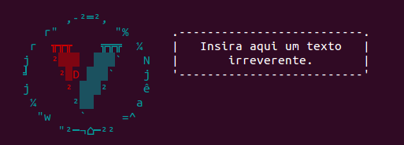

# vtexsay

> Tell VTEX what to say

Like [cowsay](http://en.wikipedia.org/wiki/Cowsay), but less cow.




## Install

```sh
$ npm install --save vtexsay
```


## Usage

```js
var vtexsay = require('vtexsay');

console.log(vtexsay('Hello, and welcome to my fantastic generator full of whimsy and bubble gum!'));

/*
        ,-²═²,        
     r"        "%      .--------------------------.
   r  ╥╥╥    ╦╦╦  ¼    | Hello, and welcome to my |
  j   ²▒▒▒  ▒▒▒`   N   | fantastic generator full |
  ╛    ²▒D ▒▒▒`    j   |   of whimsy and bubble   |
  j     ² ▒▒▒²     ê   |           gum!           |
   ¼     ²▒▒      a    '--------------------------'
    "w    `     =^     
       "²─¬⌂─²²        
 */
```

*You can style your text with [chalk](https://github.com/sindresorhus/chalk) before passing it to `vtexsay`.*


## CLI

```
$ npm install --global vtexsay
```

```
$ vtexsay --help

  Usage
    vtexsay <string>
    vtexsay <string> --maxLength 8
    echo <string> | vtexsay

  Example
    vtexsay 'Sindre is a horse'

        ,-²═²,        
     r"        "%      
   r  ╥╥╥    ╦╦╦  ¼    
  j   ²▒▒▒  ▒▒▒`   N   .--------------------------.
  ╛    ²▒D ▒▒▒`    j   |     Sindre is a horse    |
  j     ² ▒▒▒²     ê   '--------------------------'
   ¼     ²▒▒      a    
    "w    `     =^     
       "²─¬⌂─²²        
```


## License

[BSD license](http://opensource.org/licenses/bsd-license.php)
Copyright (c) Google
